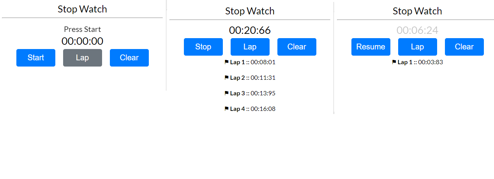

# StopWatch

Light weight Stop-Watch application using Angular 7 without external libraries/dependencies



## Demo

Checkout the demo on StackBlitz - https://split-lap-stopwatch.stackblitz.io/ 

## Adding the component in your project

### Add Component in module
Import
`
import { TimerComponent } from './timer/timer.component';
`

Declaration
`
declarations: [
    TimerComponent
  ]
`

### Add selector in HTML
```
<app-timer [start]="_start" [showTimerControls]="true"></app-timer>
```
### Selector Properties
Property `start` and `showTimerControls` accept boolean values.
Example : 
```
<button (click)="_start = true">Start</button>
<button (click)="_start = false">Clear</button>
```
### timer.component.ts
``` typescript
import { Component, OnInit, OnDestroy, Input, SimpleChanges } from '@angular/core';
@Component({
  selector: 'app-timer',
  templateUrl: './timer.component.html',
  styleUrls: ['./timer.component.scss']
})


export class TimerComponent implements OnInit, OnDestroy {
  clock: any;
  minutes: any = '00';
  seconds: any = '00';
  milliseconds: any = '00';

  @Input() start: boolean;
  @Input() showTimerControls: boolean;

  constructor() {

  }
  ngOnChanges(changes: SimpleChanges) {
    console.log(changes['start']);
    if (changes['start'].currentValue) {
      this.startTimer();
    }
    else{
      this.clearTimer();
    }
  }

  laps: any = [];
  counter: number;
  timerRef;
  running: boolean = false;
  startText = 'Start';


  startTimer() {
    this.running = !this.running;
    if (this.running) {
      this.startText = 'Stop';
      const startTime = Date.now() - (this.counter || 0);
      this.timerRef = setInterval(() => {
        this.counter = Date.now() - startTime;
        this.milliseconds = Math.floor(Math.floor(this.counter % 1000) / 10).toFixed(0);
        this.minutes = Math.floor(this.counter / 60000);
        this.seconds = Math.floor(Math.floor(this.counter % 60000) / 1000).toFixed(0);
        if (Number(this.minutes) < 10) {
          this.minutes = '0' + this.minutes;
        } else {
          this.minutes = '' + this.minutes;
        }
        if (Number(this.milliseconds) < 10) {
          this.milliseconds = '0' + this.milliseconds;
        } else {
          this.milliseconds = '' + this.milliseconds;
        }
        if (Number(this.seconds) < 10) {
          this.seconds = '0' + this.seconds;
        } else {
          this.seconds = '' + this.seconds;
        }
      });
    } else {
      this.startText = 'Resume';
      clearInterval(this.timerRef);
    }
  }
  lapTimeSplit() {
    let lapTime = this.minutes + ':' + this.seconds + ':' + this.milliseconds;
    this.laps.push(lapTime);
  }

  clearTimer() {
    this.running = false;
    this.startText = 'Start';
    this.counter = undefined;
    this.milliseconds = '00',
      this.seconds = '00',
      this.minutes = '00';
    this.laps = [];
    clearInterval(this.timerRef);
  }

  ngOnDestroy() {
    clearInterval(this.timerRef);
  }
  ngOnInit() {
  }

}
```

### timer.component.html
``` typescript
<div class="container">
	<section class="timer-counter-label">
		<div *ngIf="counter" [ngClass]="{blink: !running}">
			<span>{{minutes}}:</span><span>{{seconds}}:</span> <span>{{milliseconds}}</span> </div>
		<div *ngIf="!counter">
			<span>{{minutes}}:</span><span>{{seconds}}:</span> <span>{{milliseconds}}</span>
		</div>
	</section>
	<div class="timer-button-container" *ngIf="showTimerControls">
		<button class="timer-button" (click)="startTimer()">
			{{ startText }}
		</button>
		<button [disabled]='!counter' [ngClass]="{'disabled': !counter}" class="timer-button" (click)="lapTimeSplit()">Lap</button>
		<button class="timer-button" (click)="clearTimer()">Clear</button>
		<br>
		<div *ngFor="let lap of laps;let i = index">
			<div> &#9873; <b>Lap {{i+1}} ::</b>  {{lap}}</div>
			<br>
		</div>
	</div>
</div>
```

### timer.component.scss
``` typescript
.container {
    text-align: center;
    font-family: Lato;
  }
  .timer-counter-label{
    align-items: center;
    font-size: 27px;
  }
  .timer-start-text{
    font-size: 20px;
  }
  .timer-button{
        outline: none;
        cursor: pointer;
        border: 1px solid #007bff;
        border-radius: 5px;
        background: #007bff;
        color: #fff;
        font-size: 20px;
        padding: 10px;
        margin: 5px 10px;
        min-width: 100px;
  }
  .timer-button:hover{
    background: #0069d9;
    border: 1px solid #0062cc;
  }
  .disabled{
    cursor: not-allowed;
    background-color: #6c757d;
    border:1px solid #6c757d;
  }
  .disabled:hover{
    cursor: not-allowed;
    background-color: #5a6268;
    border:1px solid #545b62;
  }
  .blink {
    animation: blinker 1s linear infinite;
  }
  @keyframes blinker {
    50% {
      opacity: 0;
    }
  }
```


## Author

animesh.rawat20@gmail.com
